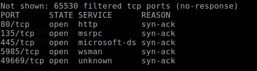
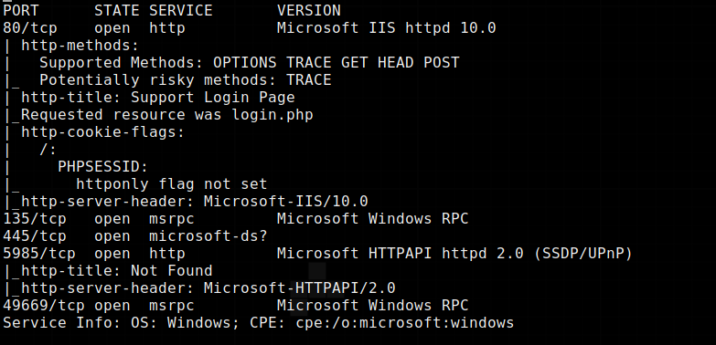

### Chocokrypt.
### Writeup for Heist machine, from HackTheBox (just pwned this machine previusly, i'm just updating the writeups.)

# Discovery:
runing nmap we can see it's a machine with this ports open.\

\
when we go into the page that is open on port 80, we can login as guest and we can see a conversation between a user named "Hazard" and the admin page, in this conversation we can see that they share some files with some hashes.\
the hashes are:
1. $1$pdQG$o8nrSzsGXeaduXrjlvKc91
2. 0242114B0E143F015F5D1E161713
3. 02375012182C1A1D751618034F36415408

So lets crack those hashes with hashcat.
using a tool called "name that hash" i'ts easy to see that:
1. First hash is md5
2. The second hash is a hash Cisco type 7
3. The third hash is a hash is also Cisco Type 7

Using hashcat, we can crack the md5 hash  hash easily. For the otherones we can use this webpage. https://www.firewall.cx/cisco-technical-knowledgebase/cisco-routers/358-cisco-type7-password-crack.html
1. For first hash the password is stealth1agent
2. For second hash the password is $uperP@ssword
3. For third hash the password is Q4)sJu\Y8qz
then we already know that there is a username named Hazard, however, i will use Cewl to collect a list of all the users in the conversation. Then i will use Medusa to crack those hashes. There are other tools like crackmapexec to bruteforce smb service
