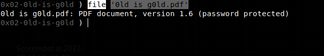
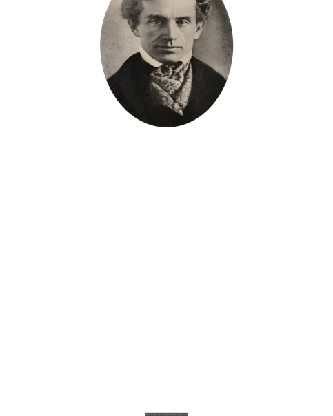

# Chocokrypt.
# Writeup for "0ld is g0ld" challenge from Hack The Box. 
## This is a challenge about cracking a pdf, we have a pdf called "0ld is g0ld.pdf" but we dont know the password

# Solution:
First, i tried to use hashcat to crack the pdf, using file command we can check that this is a pdf version 1.6

however, after tryng to use hashcat for a while i found a tool that is called pdfcrack, so...
[ppdfcrack](img/ppdfcrack.png)
this gives us that the pdf's key is: "jumanji69"
so we open the pdf and we have this:

after checking for a while i realized that there is a morse code on the pdf:
".-. .---- .--. ... .- -- ..- ...-- .-.. -- ----- .-. ... ...--"
and after decoding it the text is:
"R1PSAMU3LM0RS3"
then the flag is HTB{R1PSAMU3LM0RS3}
